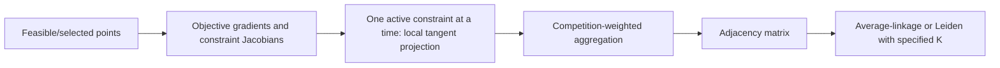

# DTLZ9–ORCA Phase 0：仓库审计与实验边界

## 结论先行

现有 nonlinear ORCA 可以直接复用其目标梯度采样、约束活跃性判断、加权聚合和固定组数聚类，但它当前的局部几何计算是“每次只投影到一个约束的切空间”，而 DTLZ9 的真实分组结构存在于多个约束同时活跃时的联合切空间。因此，Phase 1–3 不修改 ORCA 核心，而是建立一个外部 DTLZ9 适配器和对照实验层，同时比较 current ORCA 与 joint-active-tangent 版本。

## Material Passport

- 用户材料：`DTLZ9_ORCA_Codex_Starter_Prompt.md` 与 `DTLZ9_ORCA_Research_and_Experiment_Plan.md`。
- 关联项目对话：同一项目内 DTLZ5/DTLZ6 objective grouping 与性能实验任务。
- 被审计代码：现有 ORCA Python 包的 nonlinear pipeline、局部 objective interaction、competition-weighted aggregation、objective grouping 与 selected-point generation。
- 新增代码边界：仅位于本项目的 `dtlz9_experiments/`；现有 ORCA 仓库未被修改。
- 验证状态：本报告中的代码路径和行为均由本地读取确认；数值结论由 Phase 2–3 实际运行确认。

## 现有 ORCA 数据流

关键审计结果：

1. nonlinear pipeline 支持 objective gradients、constraint Jacobian 和 active-constraint tolerance。
2. correlation aggregation 使用默认 `alpha_weight=0.9`、`beta_weight=100`，对负相关/竞争边加大权重。
3. objective grouping API 要求 `num_groups`；average linkage 会一直合并到指定 K。
4. selected-point generation 的局部表面探索以单个约束为主，不能保证样本覆盖 DTLZ9 的全约束交集。
5. ORCA benchmark 中没有可直接满足本研究需要的 DTLZ9 analytical adapter，因此需要新增外部 problem implementation。

## DTLZ9 对现有算法的三个结构性挑战

### 1. 原始梯度正交

DTLZ9 每个 objective 使用不重叠的 decision-variable block，因此原始 objective gradients 两两正交。raw cosine matrix 的非对角元素理论上全部为 0，不能识别第一组 objectives 的共同变化。

### 2. 关系只在联合约束切空间中显现

在精确 Pareto front 上，`M-1` 个结构约束同时活跃。将 objective gradients 投影到这些约束的联合切空间后，`f1...f(M-1)` 同向，`fM` 与它们反向。逐约束投影会丢失第一组内部的 `+1` 关系。

### 3. 固定 K 会掩盖“没有证据”

当所有第一组内部边都为 0 时，固定 `K=2` 的 average linkage 仍可能因确定性的 tie-breaking 输出正确标签。这不是对 correlation strength 的恢复，也不代表未知组数时能够发现真实 grouping。因此 Phase 3 同时报告固定 K 和 unknown-K positive-component 结果。

## DTLZ9 适配决策

- 采用标准 `p=0.1` block-sum objectives 和 `M-1` 个结构不等式约束。
- box bounds 由 problem repair 单独处理，不作为 ORCA active constraints 暴露。原因是 `n=10M` 的精确 PF decision vectors 会非常接近 0；若按 `1e-8` 量级容差把 box bounds 计入活跃约束，会产生大量数值上的伪活跃边界。
- 精确 PF 和受控污染实验直接使用解析构造，不依赖 selected-point repair。
- selected-point repair 是确定性的 feasible repair，并未声称是 ORCA 论文中的精确欧氏投影；其结果单独标注为 point-generation diagnostic。

## Phase 1–3 验收标准

- 解析 objective/constraint Jacobian 与有限差分相符。
- 精确 PF 的约束残差、联合投影矩阵误差和投影算子残差达到数值精度。
- 对 objective normal extensions 和等价约束行变换具有联合几何不变性。
- 同时报告 signed strengths、fixed-K grouping、unknown-K grouping、ARI/NMI/F1 和估计组数。
- 覆盖 `M={3,5,10,20}`、`n/M={1,10}`、部分活跃约束、异质污染、梯度噪声和现有 ORCA selected points。

## Phase 0 决策

**通过，可以进入实现。** 但研究问题必须拆成两个判断：

1. current ORCA 是否输出看似正确的固定 K 标签；
2. current ORCA 是否真正恢复了可解释的 objective correlation/competition strengths。

Phase 3 的核心判据是第二项，而不是只看固定 `K=2` 的标签准确率。
